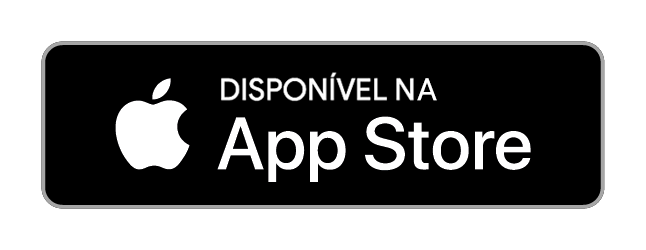
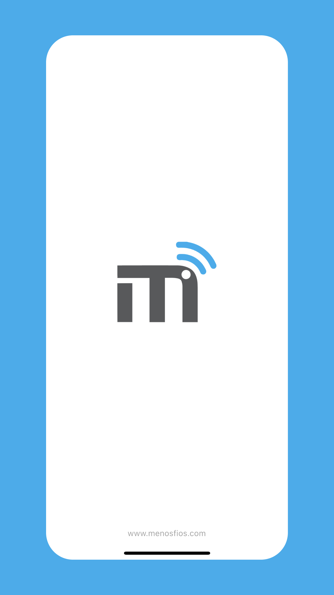
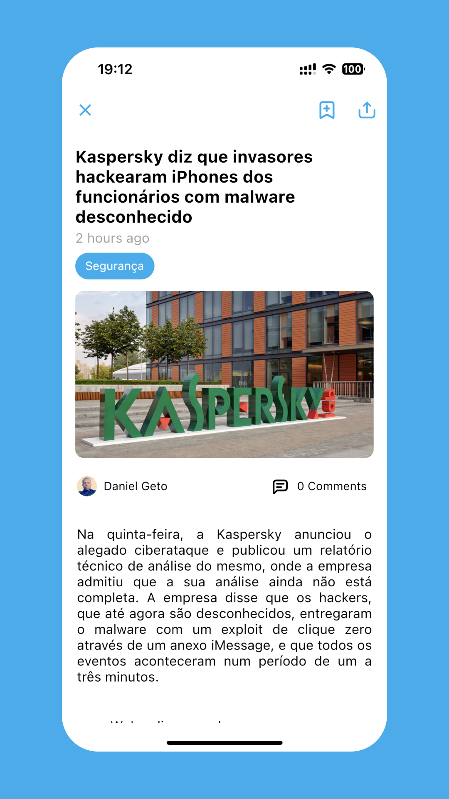
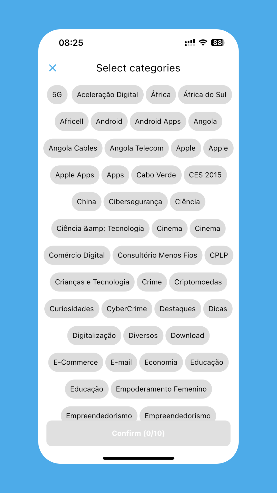
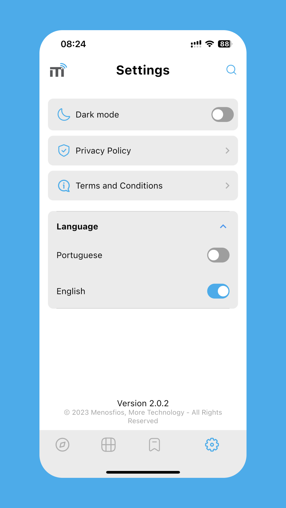
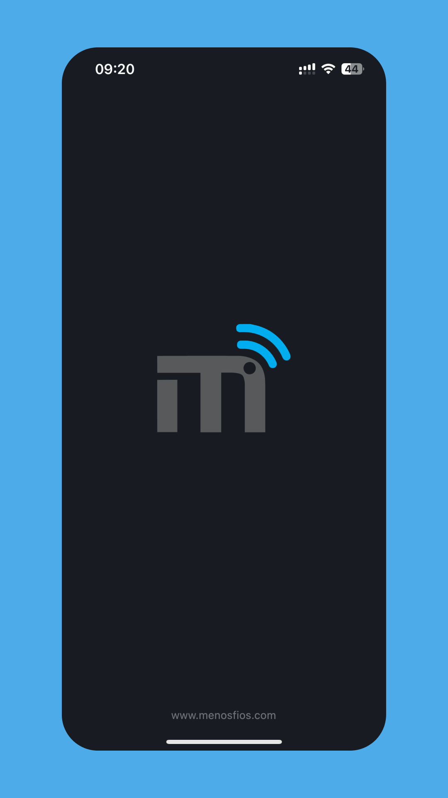
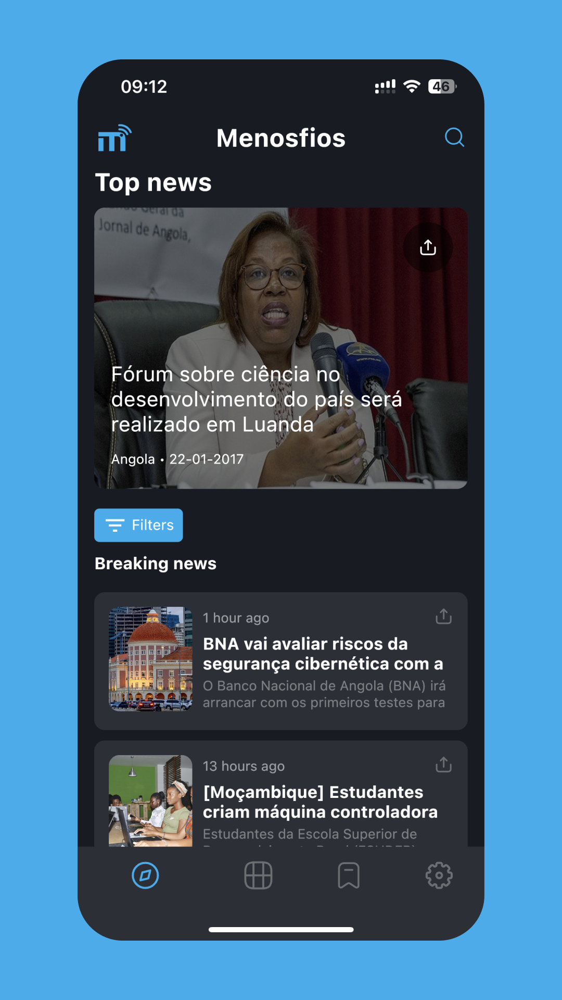
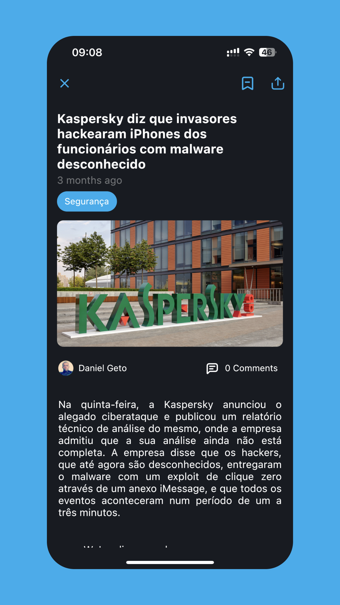
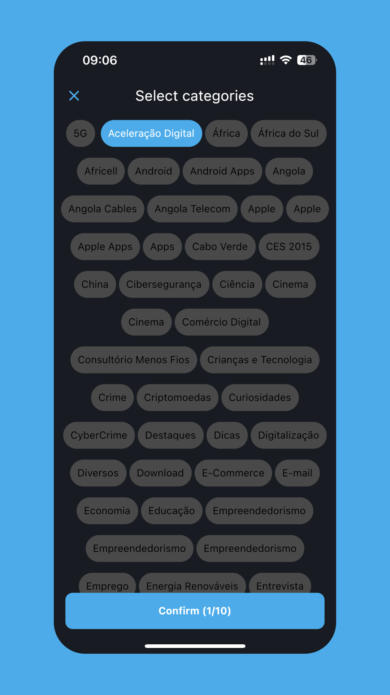
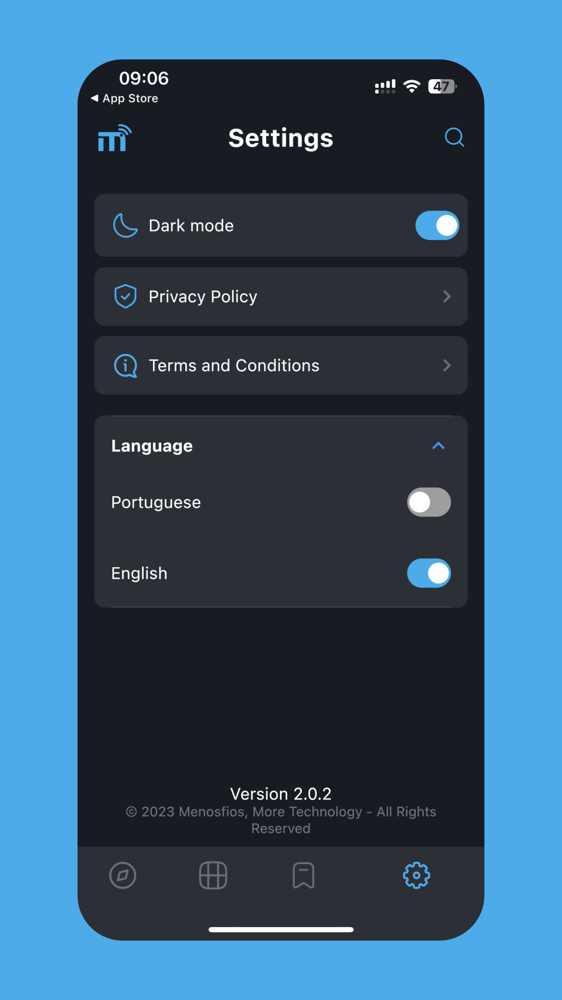

# [Menosfios](https://www.menosfios.com/)

  

 
 
 
  

## Description

O Menos Fios é um serviço de informação direccionado à área de tecnologia.

Criado por Angolanos, onde residem os seus editores e colaboradores directos, tencionamos trazer artigos sobre tecnologia, ciência e afins, com uma maior incidência à tópicos que envolvam Angola.

As opiniões dos nossos editores e colaboradores são baseadas nas suas experiências. O Menos Fios pretende que elas (as opiniões) sejam imparciais, servindo assim de guia para todos amantes da tecnologia.

## 📸 Screenshots

     
     
     
     
     

     
     
     
     
     

